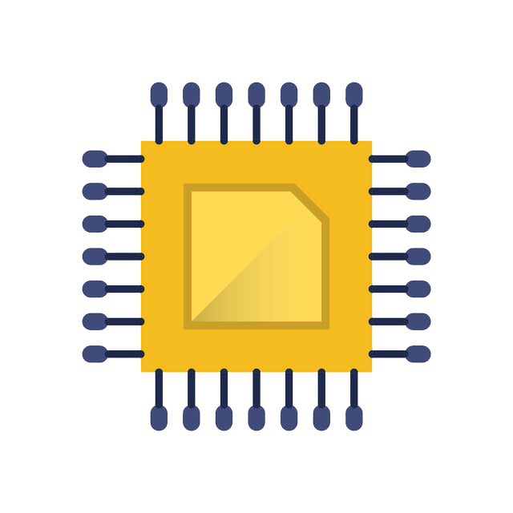

# several-type-resources

This is a list of resources that were interesting for me, and maybe
could be useful for someone else.

## AI 
 - [The Fastai Book](https://github.com/fastai/fastbook)
 - [Deep detect](https://github.com/beniz/deepdetect)
 - [HowTo100M](https://www.di.ens.fr/willow/research/howto100m/)
 - [Awesome Production Machine Learning](https://github.com/EthicalML/awesome-production-machine-learning)
 - [Pytorch Tutorial](https://github.com/yunjey/pytorch-tutorial)
 - [Let's build GPT: from scratch, in code, spelled out](https://www.youtube.com/watch?v=kCc8FmEb1nY)
 - [Neural Networks: Zero to Hero](https://karpathy.ai/zero-to-hero.html)
 - [ML dev setup](https://www.craft.do/s/WaF8mlClNnheaM/b/5C4A64F7-16CA-4F2F-AD6A-9545270ED32E/Scaling-deep-learning)
 - [Using neural nets to recognize handwritten digits](http://neuralnetworksanddeeplearning.com/chap1.html)

## Arduino 
 - [Arduino Cheatsheet](https://github.com/liffiton/Arduino-Cheat-Sheet)
 - [Prometec](https://www.prometec.net/indice-tutoriales/)
 - [Arduino Songs](https://github.com/robsoncouto/arduino-songs)
 
## C 
 - [Recommended C style and coding rules](https://github.com/MaJerle/c-code-style)
 - [C Language Links](https://github.com/DJviolin/the-c-programming-language/blob/master/c-cheat-sheet.md)

## CSS 
 - [CSS Cheatsheet](https://github.com/AdamMarsden/css-cheat-sheet)

## Electronics 
 - [Filtro Pasa bajos Pasivo de 2do Orden RC](https://wilaebaelectronica.blogspot.com/2017/01/filtro-pasa-bajos-pasivo-de-2do-orden-rc.html)
 - [Index of Pspice Simulator Libs](http://robustdesignconcepts.com/files/pspice/libs/)
 - [Rubber Duck with Arduino UNO](https://github.com/Lacerda53/duckduino)

## Git 
 - [A Successful Git Branching Model](https://nvie.com/posts/a-successful-git-branching-model/)
 - [Git Cheatsheet](https://gist.github.com/hofmannsven/6814451)
 - [Gitignore Generator](https://www.toptal.com/developers/gitignore)
 - [Github Workflow](https://guides.github.com/introduction/flow/)
 - [Gitignore.io](https://www.toptal.com/developers/gitignore)

## Go Language 
 - [Go by Example](https://gobyexample.com/)
 - [Go Cheatsheet](https://github.com/a8m/golang-cheat-sheet)
 - [Learn Go in 12 Minutes](https://www.youtube.com/watch?v=C8LgvuEBraI)
 - [Learn Go Programming - Golang Tutorial for Beginners](https://www.youtube.com/watch?v=YS4e4q9oBaU&ab_channel=freeCodeCamp.org)

## HTML (WEB) 
 - [Odin Project Curriculum](https://www.theodinproject.com/)
 - [Easings Functions](https://easings.net/)

## Javascript 
 - [Javascript Cheatsheet](https://github.com/krishnr/JavaScript-cheat-sheet)
 - [Javascript Question](https://github.com/lydiahallie/javascript-questions)
 - [Javascript Module Patterns](http://www.adequatelygood.com/JavaScript-Module-Pattern-In-Depth.html)

## Markdown 
 - [Basic Sintax](https://www.markdownguide.org/basic-syntax/)
 - [Mardown Cheatsheet](https://github.com/adam-p/markdown-here/wiki/Markdown-Cheatsheet)
 - [Complete list of github markdown emoji markup](https://gist.github.com/rxaviers/7360908)

## Neovim 
 - [NeoVim Cheatsheet](https://devhints.io/vim)
 - [Vim Galore](https://github.com/mhinz/vim-galore)

## Pug 
 - [Pug Cheatsheet](https://gist.github.com/uxblonde/0dc6735949b9cfa52cbbb3a0b9a7cef7)

## Python 
 - [Python Cheatsheet](https://github.com/gto76/python-cheatsheet)
 - [Python Tutorial: re Module - How to Write and Match Regular Expressions (Regex)](https://www.youtube.com/watch?v=K8L6KVGG-7o)
 - [Pip Cheatshet](http://dcjtech.info/wp-content/uploads/2015/10/Pip-Cheatsheet.pdf)
 - [Packaging PySide6 applications for Windows with PyInstaller & InstallForge](https://www.pythonguis.com/tutorials/packaging-pyside6-applications-windows-pyinstaller-installforge/)

## Sass/Scss 
 - [Sass Cheatsheet](https://devhints.io/sass)

## STM32F4 Microcontrollers and Boards 
 - [Tilen Majerle STM32F4 Web Page](https://stm32f4-discovery.net/)
 - [Tilen Majerle STM32F4 libraries](http://stm32f4-discovery.net/2014/05/all-stm32f429-libraries-at-one-place/)
 - [STM32-Tutorials](https://github.com/MYaqoobEmbedded/STM32-Tutorials)

## Linux 
 - [How to disable keyring popup on Ubuntu](https://linuxconfig.org/how-to-disable-keyring-popup-on-ubuntu#:~:text=In%20the%20keyring%20application%2C%20right,and%20click%20on%20Change%20Password%20.&text=Authenticate%20with%20the%20keyring%20by%20using%20your%20current%20password.&text=Leave%20the%20password%20fields%20blank%20and%20simply%20click%20Continue%20.&text=Ubuntu%20will%20warn%20you%20that,passwords%20in%20an%20unencrypted%20format.)

## Common Use Cheatsheets
 - [Awesome](https://github.com/sindresorhus/awesome#programming-languages)
 - [Awesome Cheatsheets](https://github.com/detailyang/awesome-cheatsheet)
 - [Awesome Command Line Apps](https://github.com/herrbischoff/awesome-command-line-apps)
 - [Awesome Shell](https://github.com/alebcay/awesome-shell)
 - [Awesome Programming Language](https://github.com/sindresorhus/awesome#programming-languages)
 - [Easing Functions Cheatsheet](https://easings.net/)
 - [Git Cheatsheet](https://gist.github.com/hofmannsven/6814451)
 - [Nerd Fonts Cheatsheet](https://www.nerdfonts.com/cheat-sheet)
 - [Vim Galore](https://github.com/mhinz/vim-galore)
 - [Build your own X](https://github.com/codecrafters-io/build-your-own-x)
 - [Rapid API](https://rapidapi.com/hub)

## Other
 - [Emoji List](https://es.piliapp.com/emoji/list/)
 - [Refactoring and Design Patters](https://refactoring.guru/)
 - [How To Build Recommendation Algorithms And System Designs](https://www.theinsaneapp.com/2021/03/system-design-and-recommendation-algorithms.html)
 - [Developer Roadmap](https://roadmap.sh/)
 - [David.li](http://david.li/)
 - [Emupedia](https://emupedia.net/beta/emuos/)
 
## Interesting Posts
 - [Implementing Async Features in Python - A Step-by-step Guide](https://www.velotio.com/engineering-blog/async-features-in-python#:~:text=An%20async%20function%20uses%20the,Tasks%20as%20a%20Future%20object)
 - [Making an Algorithm 1,606,240% FASTER](https://www.youtube.com/watch?v=U16RnpV48KQ)

## Tools
- [Pandoc](https://pandoc.org/getting-started.html)
- [Cheat.sh](https://github.com/chubin/cheat.sh)
- [GNU datamash](https://www.gnu.org/software/datamash/)
- [archuseriso](https://github.com/laurent85v/archuseriso)
- [halp](https://github.com/orhun/halp)
- [SQLite Viewer](https://inloop.github.io/sqlite-viewer/)
- [12ft Ladder](https://12ft.io/)
- [Web Archive](https://web.archive.org/)

### AI
 - [ChatGPT](https://chat.openai.com/chat)
 - [DALL-E](https://openai.com/product/dall-e-2)
 - [DoNotPay](https://donotpay.com/)
 - [CopyAI](https://www.copy.ai/)
 - [Axiom](https://axiom.ai/)
 - [WolframAlpha](https://www.wolframalpha.com/?source=wordcloud)
 - [TinyWoW](https://tinywow.com/)

## Design
- [Fontastic](https://fontastic.me/)
- [Font Awesome Icons](https://fontawesome.com/icons?d=gallery&m=free)
- [Silk](http://weavesilk.com/)
- [Dafont](https://www.dafont.com/es/)
- [Google Fonts](https://fonts.google.com/)
- [Calligraphr](https://www.calligraphr.com/es/)
- [AutoDraw](https://www.autodraw.com/)
- [Freepik](https://www.freepik.es/psd-populares)
- [Mirroful](https://github.com/Mirrorful/mirrorful)
- [Gridzzly](http://gridzzly.com/)
- [Animatiss](https://xsgames.co/animatiss/)

## Academic
- [Resoomer](https://resoomer.com/es/)
- [Smodin](https://smodin.io/)
- [Sci-hub](https://sci-hub.se/)
- [Slidergo](https://slidesgo.com/)
- [Doc Downloader](https://docdownloader.com/)
- [Cite This Forme](https://www.citethisforme.com/)
- [Dianet](https://dialnet.unirioja.es/)
- [Creately](https://creately.com/)
- [Filadd](https://filadd.com/)
- [Library Genesis](http://libgen.rs/)
- [WhatTheFont](https://www.myfonts.com/pages/whatthefont)
- [Google Academics](https://scholar.google.com/)
- [PDFDrive](https://www.pdfdrive.com/)

## Learning Tools
- [Codewars](https://www.codewars.com/dashboard)
- [Hackerrank](https://www.hackerrank.com/)
- [Learn X in Y minutes](https://learnxinyminutes.com/)
- [Leetcode](https://leetcode.com/)
- [Exercism](https://exercism.org/)
